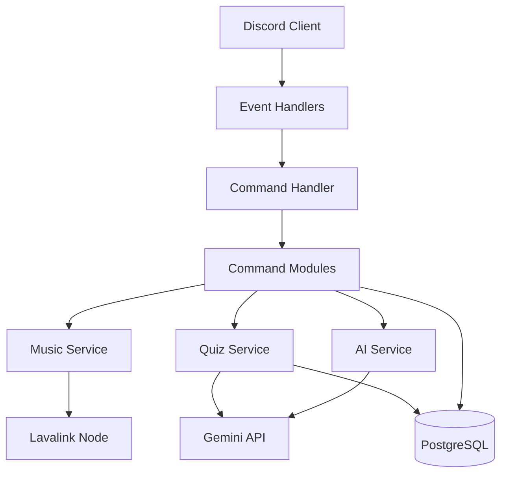

# Architecture

## Overview
anobystore is built using a modular architecture focusing on separation of concerns. The system is divided into several layers: Services, Commands, Events, and Data Access.

## Diagram

## Layers
1. **Discord Layer:** Handles incoming events and interactions.
2. **Command Layer:** Parses user input and triggers specific logic.
3. **Service Layer:** Core business logic for Music, AI, Quiz.
4. **Data Layer:** Prisma ORM connecting to PostgreSQL/SQLite.
